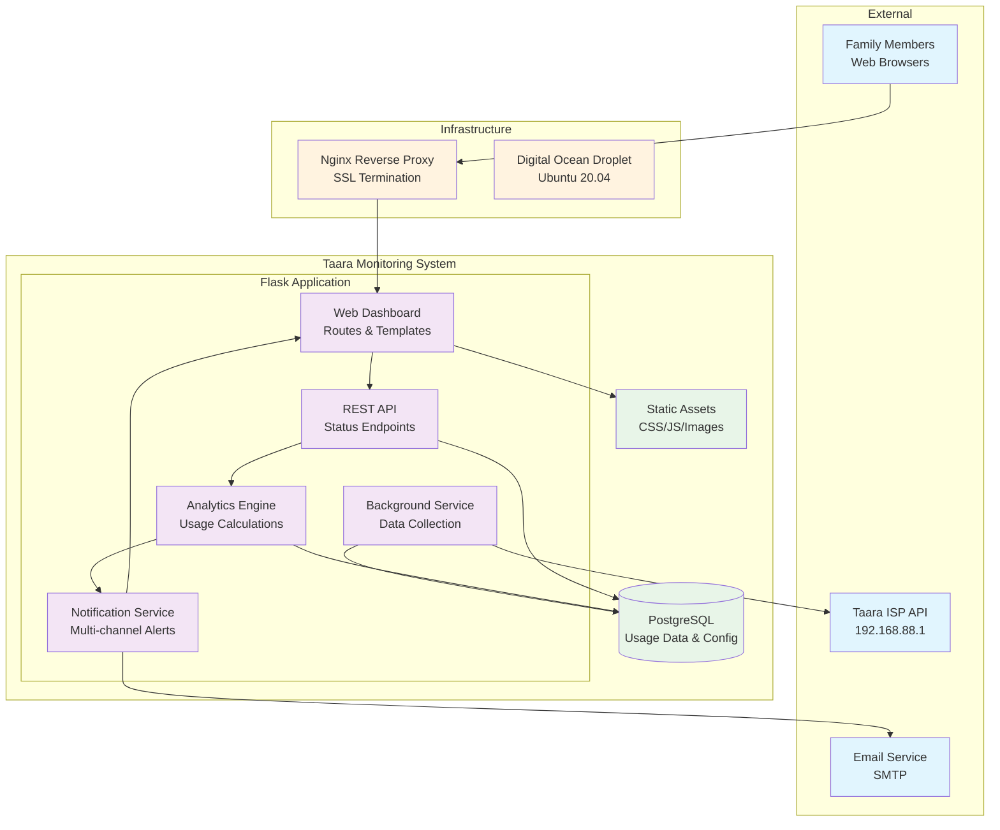
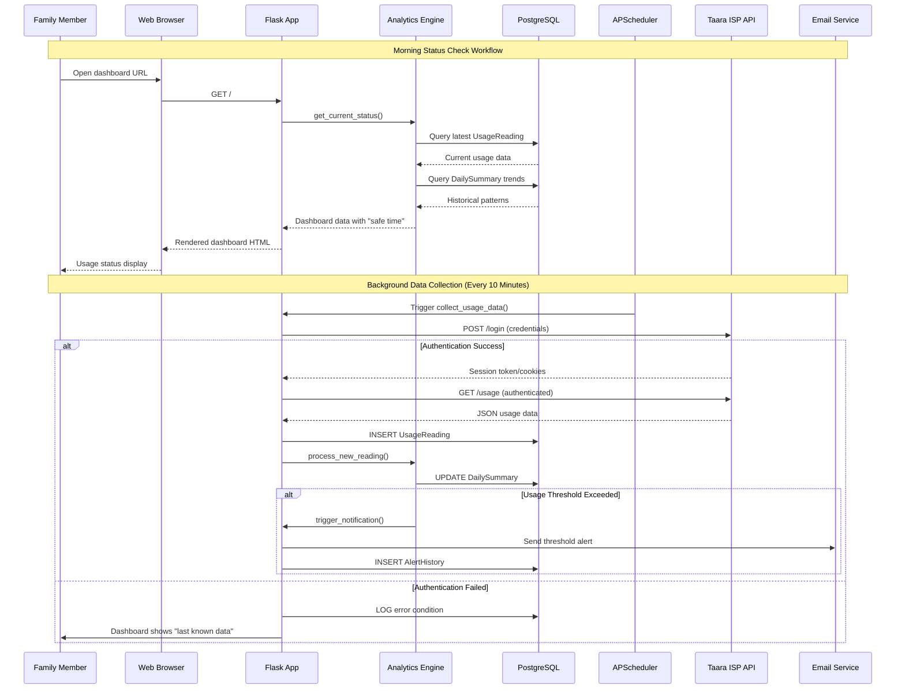

# Taara Internet Usage Monitoring System Architecture Document

**Document Information:**
- **Product Name:** Taara Internet Usage Monitoring System
- **Document Version:** v1.0
- **Date Created:** August 23, 2025
- **Last Updated:** August 23, 2025
- **Document Owner:** BMad Master (Architecture Agent)
- **Status:** Complete

---

## Introduction

This document outlines the overall project architecture for **Taara Internet Usage Monitoring System**, including backend systems, shared services, and non-UI specific concerns. Its primary goal is to serve as the guiding architectural blueprint for AI-driven development, ensuring consistency and adherence to chosen patterns and technologies.

**Relationship to Frontend Architecture:**
This project includes a significant web dashboard interface. The Frontend Architecture is detailed in the separate Frontend Specification Document (`docs/front-end-specification.md`) and MUST be used in conjunction with this document. Core technology stack choices documented herein (see "Tech Stack") are definitive for the entire project, including frontend components.

### Starter Template or Existing Project

**Decision:** No starter template will be used. The project will use a custom Flask application structure optimized for the specific requirements of ISP data monitoring and family-centric analytics. This decision supports the PRD requirement for lightweight deployment while maintaining clear component separation for future extensibility.

### Change Log

| Date | Version | Description | Author |
|------|---------|-------------|---------|
| 2025-08-23 | v1.0 | Initial architecture document creation | BMad Master |

---

## High Level Architecture

### Technical Summary

The Taara Internet Usage Monitoring System employs a **lightweight monolithic architecture** with clear modular separation, designed for efficient operation within budget hosting constraints (512MB RAM, 20% CPU). The system centers around a Flask-based web application with automated background data collection, real-time analytics processing, and multi-channel notification delivery. Core technology choices include Python/Flask for rapid development, PostgreSQL for robust data storage, and Bootstrap for responsive UI, all optimized for Digital Ocean deployment. This architecture directly supports PRD goals of 99% uptime, sub-2-second response times, and reliable 10-minute ISP API polling while maintaining extensibility for future mobile app integration and multi-household deployment.

### High Level Overview

**1. Architectural Style:** Lightweight Monolithic Application with Modular Components
- Single deployable unit for simplified hosting and maintenance
- Clear internal module boundaries enabling future microservice extraction
- Shared database and runtime for optimal resource utilization

**2. Repository Structure:** Monorepo (single repository)
- All components in unified codebase for simplified development
- Clear directory separation for modules and concerns
- Supports AI agent development workflow with centralized context

**3. Service Architecture:** Modular Monolith
- Data Collection Service (background polling)
- Analytics Engine (usage calculations and predictions)
- Web Dashboard (user interface and API)
- Notification Service (multi-channel alerts)
- All services sharing common Flask application context

**4. Primary User Interaction Flow:**
   - User accesses web dashboard → View real-time usage status → Receive proactive notifications → Optimize usage behavior
   - Background: System polls ISP API → Processes analytics → Triggers notifications → Updates dashboard

**5. Key Architectural Decisions:**
   - **Monolith over Microservices:** Budget hosting constraints and development simplicity
   - **Flask over FastAPI:** Template integration simplicity and Python ecosystem maturity
   - **PostgreSQL over MySQL:** JSON support for flexible analytics and advanced features
   - **Background tasks in-process:** Avoiding external queue complexity for budget deployment

### High Level Project Diagram



### Architectural and Design Patterns

- **Modular Monolith Pattern:** Clear module separation within single deployment - *Rationale:* Enables future microservice extraction while maintaining current budget hosting simplicity and shared resource efficiency

- **Repository Pattern:** Abstract data access through dedicated repository classes - *Rationale:* Facilitates testing with mock data and enables future database migration flexibility without business logic changes

- **Background Task Pattern:** In-process scheduled tasks using APScheduler - *Rationale:* Avoids external queue infrastructure complexity while maintaining reliable 10-minute ISP polling requirements

- **Service Layer Pattern:** Business logic encapsulated in dedicated service classes - *Rationale:* Separates analytics calculations, notification logic, and data processing from web framework concerns

- **Configuration Pattern:** Environment-based configuration with explicit defaults - *Rationale:* Supports development/production deployment differences and secure credential management per PRD security requirements

- **Observer Pattern:** Event-driven notifications triggered by usage threshold changes - *Rationale:* Enables flexible notification rules and future integration with additional alert channels (Galaxy Watch, Tasker)

---

## Tech Stack

### Cloud Infrastructure

- **Provider:** Digital Ocean
- **Key Services:** Droplets (compute), Managed PostgreSQL (optional), Spaces (backup storage), Monitoring, Load Balancers (future)
- **Deployment Regions:** Primary region based on user location (likely Frankfurt/Amsterdam for East Africa connectivity)

### Technology Stack Table

| Category | Technology | Version | Purpose | Rationale |
|----------|------------|---------|---------|-----------|
| **Language** | Python | 3.11.5 | Primary development language | Mature ecosystem, excellent analytics libraries, team expertise, PRD selection |
| **Web Framework** | Flask | 2.3.3 | Web application framework | Lightweight, excellent templating, PRD selection for simplicity |
| **Database (Prod)** | PostgreSQL | 15.4 | Primary data storage | JSON support, scalability, PRD selection for analytics features |
| **Database (Dev)** | SQLite | 3.42.0 | Development database | Zero-config development, PRD selection for rapid iteration |
| **ORM** | SQLAlchemy | 2.0.21 | Database abstraction | Mature, Flask integration, migration support, security features |
| **Frontend CSS** | Bootstrap | 5.3.2 | UI framework | Responsive design, PRD selection, rapid development |
| **Task Scheduler** | APScheduler | 3.10.4 | Background ISP polling | In-process scheduling, no external dependencies |
| **HTTP Client** | Requests | 2.31.0 | ISP API integration | Reliable, mature, session management features |
| **Encryption** | Cryptography | 41.0.4 | Credential protection | AES-256 encryption, PRD security requirement |
| **Web Server** | Gunicorn | 21.2.0 | WSGI application server | Production deployment, process management |
| **Reverse Proxy** | Nginx | 1.18.0 | Load balancing, SSL | PRD deployment choice, static file serving |
| **Process Management** | Supervisor | 4.2.5 | Service management | Auto-restart, logging, PRD deployment choice |
| **Testing Framework** | Pytest | 7.4.2 | Unit and integration testing | Comprehensive testing, fixture support |
| **Environment** | Ubuntu | 20.04 LTS | Operating system | PRD deployment choice, long-term support |
| **Email Service** | Flask-Mail | 0.9.1 | Notification delivery | SMTP integration, Flask ecosystem |
| **Logging** | Python Logging | 3.11+ | Application logging | Built-in, structured logging capability |
| **Configuration** | Python-dotenv | 1.0.0 | Environment configuration | Secure credential management, deployment flexibility |

---

## Data Models

### UsageReading

**Purpose:** Store raw usage data collected from Taara ISP API every 10 minutes

**Key Attributes:**
- `id`: Integer - Primary key, auto-increment
- `timestamp`: DateTime - When the reading was collected (UTC)
- `total_used_mb`: Integer - Total data used in MB from ISP API
- `total_allocated_mb`: Integer - Monthly allocation limit (typically 1TB = 1,048,576 MB)
- `remaining_mb`: Integer - Calculated remaining allocation
- `collection_status`: Enum - SUCCESS, FAILED, PARTIAL (API response quality)
- `api_response_time_ms`: Integer - API call performance tracking
- `raw_api_data`: JSON - Complete ISP response for debugging/audit
- `created_at`: DateTime - Record creation timestamp
- `updated_at`: DateTime - Record modification timestamp

**Relationships:**
- One-to-many with DailySummary (aggregation source)
- Referenced by AlertHistory for notification triggers

### DailySummary

**Purpose:** Aggregated daily usage statistics for analytics and trend analysis

**Key Attributes:**
- `id`: Integer - Primary key, auto-increment
- `date`: Date - Calendar date for summary (local timezone)
- `daily_usage_mb`: Integer - Total usage for the day
- `daily_budget_mb`: Integer - Calculated safe daily budget
- `budget_variance_mb`: Integer - Actual vs. budget difference (+/-)
- `usage_efficiency_score`: Float - Performance rating (0.0-1.0)
- `peak_usage_hour`: Integer - Hour with highest usage (0-23)
- `reading_count`: Integer - Number of successful API calls
- `data_quality_score`: Float - Reading reliability metric (0.0-1.0)
- `trend_direction`: Enum - INCREASING, DECREASING, STABLE
- `created_at`: DateTime - Record creation timestamp
- `updated_at`: DateTime - Record modification timestamp

**Relationships:**
- Aggregates multiple UsageReading records
- Referenced by trend analysis algorithms
- Drives notification threshold calculations

### UserPreferences

**Purpose:** Store user configuration and notification preferences

**Key Attributes:**
- `id`: Integer - Primary key, auto-increment
- `isp_username`: String(100) - Encrypted Taara ISP username
- `isp_password_encrypted`: Text - AES-256 encrypted ISP password
- `encryption_key_hash`: String(64) - Key derivation validation
- `notification_email`: String(255) - Email for notifications
- `email_enabled`: Boolean - Email notification preference
- `desktop_notifications_enabled`: Boolean - Browser notification preference
- `alert_threshold_percentage`: Integer - Usage % trigger (default: 75)
- `daily_budget_alerts`: Boolean - Daily budget notification preference
- `weekly_summary_enabled`: Boolean - Weekly report preference
- `timezone`: String(50) - User timezone for scheduling
- `created_at`: DateTime - Record creation timestamp
- `updated_at`: DateTime - Record modification timestamp

**Relationships:**
- Single record per system installation (single-household)
- Referenced by NotificationService for delivery preferences
- Referenced by BackgroundService for ISP authentication

### AlertHistory

**Purpose:** Track notification delivery and effectiveness for optimization

**Key Attributes:**
- `id`: Integer - Primary key, auto-increment
- `alert_type`: Enum - DAILY_BUDGET, THRESHOLD_WARNING, WEEKLY_SUMMARY, OPTIMIZATION_TIP
- `trigger_usage_mb`: Integer - Usage level that triggered alert
- `trigger_percentage`: Float - Percentage of allocation when triggered
- `delivery_channel`: Enum - EMAIL, DESKTOP, DASHBOARD
- `delivery_status`: Enum - SENT, FAILED, PENDING
- `message_content`: Text - Full notification content
- `user_engagement`: Boolean - Whether user accessed dashboard after alert
- `effectiveness_score`: Float - Alert impact measurement (0.0-1.0)
- `sent_at`: DateTime - Notification delivery timestamp
- `acknowledged_at`: DateTime - User interaction timestamp (nullable)
- `created_at`: DateTime - Record creation timestamp

**Relationships:**
- References UsageReading for trigger context
- References UserPreferences for delivery channel validation
- Aggregated for notification optimization algorithms

---

## Components

### DataCollectionService

**Responsibility:** Automated ISP API polling, data validation, and persistence

**Key Interfaces:**
- `collect_usage_data()` - Main polling method called every 10 minutes
- `authenticate_with_isp()` - Session management for Taara API
- `validate_api_response()` - Data integrity checking
- `store_usage_reading()` - Persist raw data to database

**Dependencies:** UserPreferences (credentials), UsageReading (storage), requests library

**Technology Stack:** 
- APScheduler for 10-minute intervals
- Requests library for HTTP client with session management
- Cryptography library for credential decryption
- SQLAlchemy for database operations
- Python logging for error tracking and audit trail

### AnalyticsEngine

**Responsibility:** Usage calculations, trend analysis, and predictive modeling

**Key Interfaces:**
- `calculate_daily_budget()` - Safe daily allocation based on remaining days
- `generate_usage_trends()` - Weekly/monthly pattern analysis
- `predict_month_end_usage()` - 90% accuracy target for projections
- `detect_usage_anomalies()` - Overage risk identification
- `calculate_safe_time_remaining()` - Core dashboard metric

**Dependencies:** UsageReading (raw data), DailySummary (aggregated data), datetime utilities

**Technology Stack:**
- Pandas for time-series analysis (if needed for complex analytics)
- Python datetime/calendar for date calculations
- SQLAlchemy for efficient data queries with proper indexing
- NumPy for statistical calculations
- Custom algorithms for family-specific usage patterns

### WebDashboardComponent

**Responsibility:** User interface, API endpoints, and session management

**Key Interfaces:**
- `GET /` - Main dashboard with usage status
- `GET /api/usage/current` - Real-time usage data endpoint
- `GET /api/trends` - Historical analytics endpoint
- `POST /preferences` - User configuration management
- `GET /health` - System health check for monitoring

**Dependencies:** AnalyticsEngine (data), UserPreferences (config), Flask routing

**Technology Stack:**
- Flask 2.3.3 with Jinja2 templating
- Bootstrap 5.3.2 for responsive UI components
- Chart.js for usage visualization (if complex charts needed)
- Flask-WTF for form handling and CSRF protection
- JSON API responses for future mobile app integration

### NotificationService

**Responsibility:** Multi-channel alert delivery and effectiveness tracking

**Key Interfaces:**
- `evaluate_notification_triggers()` - Check thresholds and conditions
- `send_email_notification()` - SMTP-based email delivery
- `send_desktop_notification()` - Browser push notifications
- `generate_weekly_summary()` - Scheduled report creation
- `track_notification_effectiveness()` - User engagement metrics

**Dependencies:** UserPreferences (delivery config), AlertHistory (tracking), AnalyticsEngine (trigger data)

**Technology Stack:**
- Flask-Mail for SMTP email integration
- Web Push API for desktop notifications (future)
- Jinja2 for email template rendering
- APScheduler for scheduled summary generation
- Custom effectiveness tracking algorithms

### ConfigurationManager

**Responsibility:** Secure credential management and system configuration

**Key Interfaces:**
- `encrypt_isp_credentials()` - AES-256 credential protection
- `decrypt_for_api_access()` - Runtime credential access
- `validate_configuration()` - Setup wizard validation
- `export_user_data()` - Privacy compliance support
- `rotate_encryption_keys()` - Security maintenance

**Dependencies:** UserPreferences (storage), Cryptography library

**Technology Stack:**
- Cryptography library for AES-256 encryption
- Python-dotenv for environment configuration
- bcrypt for password hashing (if user auth added)
- JSON schema validation for configuration integrity
- Secure random key generation

---

## External APIs

### Taara ISP API

**Purpose:** Automated collection of internet usage data for household monitoring

**Documentation:** User to provide Taara ISP API documentation or endpoint discovery required

**Base URL(s):** `http://192.168.88.1` (local ISP router interface)

**Authentication:** Session-based authentication using ISP account credentials

**Rate Limits:** 
- Maximum 1 request per 10 minutes (PRD requirement)
- 144 requests per day maximum
- Respectful polling to avoid ISP API overload
- Exponential backoff on rate limit violations

**Key Endpoints Used:**
- `POST /login` - Establish authenticated session
- `GET /usage` - Retrieve current usage statistics
- `GET /status` - Verify session validity

**Integration Notes:**
- Connection management with persistent HTTP sessions
- Data validation and consistency checking
- Comprehensive error handling with graceful degradation
- Security considerations for credential protection

---

## Core Workflows

### System Workflow Diagrams



---

## REST API Spec

```yaml
openapi: 3.0.0
info:
  title: Taara Internet Usage Monitoring API
  version: 1.0.0
  description: RESTful API for Taara Internet Usage Monitoring System

servers:
  - url: http://localhost:5000/api/v1
    description: Development server

paths:
  /usage/current:
    get:
      summary: Get current usage status
      tags: [Usage Data]
      responses:
        '200':
          description: Current usage data
          content:
            application/json:
              schema:
                type: object
                properties:
                  total_used_mb:
                    type: integer
                    example: 614400
                  remaining_mb:
                    type: integer
                    example: 434176
                  usage_percentage:
                    type: number
                    example: 58.6
                  safe_time_remaining:
                    type: integer
                    example: 18
                  daily_budget_mb:
                    type: integer
                    example: 24120
                  last_updated:
                    type: string
                    format: date-time

  /usage/trends:
    get:
      summary: Get usage trends and analytics
      tags: [Analytics]
      parameters:
        - name: period
          in: query
          schema:
            type: string
            enum: [week, month, quarter]
            default: week
      responses:
        '200':
          description: Usage trends and analytics

  /system/health:
    get:
      summary: System health check
      tags: [System]
      responses:
        '200':
          description: System is healthy
```

---

## Database Schema

```sql
-- Usage readings table (high-frequency inserts)
CREATE TABLE usage_readings (
    id SERIAL PRIMARY KEY,
    timestamp TIMESTAMP WITH TIME ZONE NOT NULL,
    total_used_mb INTEGER NOT NULL,
    total_allocated_mb INTEGER NOT NULL DEFAULT 1048576,
    remaining_mb INTEGER NOT NULL,
    collection_status VARCHAR(20) NOT NULL CHECK (collection_status IN ('SUCCESS', 'FAILED', 'PARTIAL')),
    api_response_time_ms INTEGER,
    raw_api_data JSONB,
    created_at TIMESTAMP WITH TIME ZONE DEFAULT CURRENT_TIMESTAMP,
    updated_at TIMESTAMP WITH TIME ZONE DEFAULT CURRENT_TIMESTAMP
);

-- Daily summaries table (aggregated analytics)
CREATE TABLE daily_summaries (
    id SERIAL PRIMARY KEY,
    date DATE NOT NULL UNIQUE,
    daily_usage_mb INTEGER NOT NULL,
    daily_budget_mb INTEGER NOT NULL,
    budget_variance_mb INTEGER NOT NULL,
    usage_efficiency_score DECIMAL(3,2) CHECK (usage_efficiency_score >= 0 AND usage_efficiency_score <= 1),
    peak_usage_hour INTEGER CHECK (peak_usage_hour >= 0 AND peak_usage_hour <= 23),
    reading_count INTEGER NOT NULL DEFAULT 0,
    data_quality_score DECIMAL(3,2) CHECK (data_quality_score >= 0 AND data_quality_score <= 1),
    trend_direction VARCHAR(20) CHECK (trend_direction IN ('INCREASING', 'DECREASING', 'STABLE')),
    created_at TIMESTAMP WITH TIME ZONE DEFAULT CURRENT_TIMESTAMP,
    updated_at TIMESTAMP WITH TIME ZONE DEFAULT CURRENT_TIMESTAMP
);

-- User preferences table (single household configuration)
CREATE TABLE user_preferences (
    id SERIAL PRIMARY KEY,
    isp_username VARCHAR(100) NOT NULL,
    isp_password_encrypted TEXT NOT NULL,
    encryption_key_hash VARCHAR(64) NOT NULL,
    notification_email VARCHAR(255),
    email_enabled BOOLEAN DEFAULT true,
    desktop_notifications_enabled BOOLEAN DEFAULT true,
    alert_threshold_percentage INTEGER DEFAULT 75 CHECK (alert_threshold_percentage >= 50 AND alert_threshold_percentage <= 95),
    daily_budget_alerts BOOLEAN DEFAULT true,
    weekly_summary_enabled BOOLEAN DEFAULT true,
    timezone VARCHAR(50) DEFAULT 'UTC',
    created_at TIMESTAMP WITH TIME ZONE DEFAULT CURRENT_TIMESTAMP,
    updated_at TIMESTAMP WITH TIME ZONE DEFAULT CURRENT_TIMESTAMP
);

-- Alert history table (notification tracking)
CREATE TABLE alert_history (
    id SERIAL PRIMARY KEY,
    alert_type VARCHAR(30) NOT NULL CHECK (alert_type IN ('DAILY_BUDGET', 'THRESHOLD_WARNING', 'WEEKLY_SUMMARY', 'OPTIMIZATION_TIP')),
    trigger_usage_mb INTEGER,
    trigger_percentage DECIMAL(5,2),
    delivery_channel VARCHAR(20) CHECK (delivery_channel IN ('EMAIL', 'DESKTOP', 'DASHBOARD')),
    delivery_status VARCHAR(20) CHECK (delivery_status IN ('SENT', 'FAILED', 'PENDING')),
    message_content TEXT,
    user_engagement BOOLEAN DEFAULT false,
    effectiveness_score DECIMAL(3,2),
    sent_at TIMESTAMP WITH TIME ZONE,
    acknowledged_at TIMESTAMP WITH TIME ZONE,
    created_at TIMESTAMP WITH TIME ZONE DEFAULT CURRENT_TIMESTAMP
);

-- Indexes for performance
CREATE INDEX idx_usage_readings_timestamp ON usage_readings(timestamp DESC);
CREATE INDEX idx_usage_readings_status ON usage_readings(collection_status);
CREATE INDEX idx_alert_history_type ON alert_history(alert_type);
CREATE INDEX idx_alert_history_sent ON alert_history(sent_at DESC);
```

---

## Source Tree

```
taara-monitoring/
├── app/                              # Flask application package
│   ├── __init__.py                   # Application factory
│   ├── models/                       # SQLAlchemy models
│   │   ├── __init__.py
│   │   ├── usage_reading.py          # UsageReading model
│   │   ├── daily_summary.py          # DailySummary model
│   │   ├── user_preferences.py       # UserPreferences model
│   │   └── alert_history.py          # AlertHistory model
│   ├── services/                     # Business logic services
│   │   ├── __init__.py
│   │   ├── data_collection.py        # DataCollectionService
│   │   ├── analytics_engine.py       # AnalyticsEngine
│   │   ├── notification_service.py   # NotificationService
│   │   └── configuration_manager.py  # ConfigurationManager
│   ├── api/                          # REST API endpoints
│   │   ├── __init__.py
│   │   ├── usage.py                  # Usage data endpoints
│   │   ├── notifications.py          # Notification endpoints
│   │   └── system.py                 # System health endpoints
│   ├── web/                          # Web dashboard routes
│   │   ├── __init__.py
│   │   ├── dashboard.py              # Main dashboard routes
│   │   ├── preferences.py            # User preference routes
│   │   └── setup.py                  # Initial setup wizard
│   ├── templates/                    # Jinja2 templates
│   │   ├── base.html                 # Base template with Bootstrap
│   │   ├── dashboard.html            # Main dashboard
│   │   ├── preferences.html          # Settings page
│   │   └── emails/                   # Email templates
│   ├── static/                       # Static assets
│   │   ├── css/
│   │   ├── js/
│   │   └── images/
│   ├── utils/                        # Utility modules
│   │   ├── __init__.py
│   │   ├── encryption.py             # AES-256 encryption utilities
│   │   ├── validators.py             # Data validation helpers
│   │   └── formatters.py             # Display formatting
│   └── extensions.py                 # Flask extension initialization
├── migrations/                       # Database migrations
├── tests/                            # Test suite
│   ├── unit/                         # Unit tests
│   ├── integration/                  # Integration tests
│   └── fixtures/                     # Test data
├── scripts/                          # Management scripts
├── deployment/                       # Deployment configuration
├── config/                           # Configuration files
├── requirements/                     # Python dependencies
├── .env.example                      # Environment template
├── run.py                            # Application entry point
└── README.md                         # Project documentation
```

---

## Infrastructure and Deployment

### Infrastructure as Code
- **Tool:** Ansible 2.15.0
- **Location:** `deployment/ansible/`
- **Approach:** Declarative server configuration with playbooks for Digital Ocean droplet setup

### Deployment Strategy
- **Strategy:** Blue-green deployment with health checks
- **CI/CD Platform:** GitHub Actions (free tier)
- **Pipeline Configuration:** `.github/workflows/deploy.yml`

### Environments
- **Development:** Local SQLite with Flask dev server
- **Staging:** Digital Ocean staging droplet with PostgreSQL
- **Production:** Digital Ocean production droplet with full monitoring

### Rollback Strategy
- **Primary Method:** Git-based rollback with Ansible redeployment
- **Trigger Conditions:** Health check failures, API error rate >5%
- **Recovery Time Objective:** <5 minutes for automatic rollback

---

## Error Handling Strategy

### General Approach
- **Error Model:** Custom exception hierarchy with Flask error handlers
- **Exception Hierarchy:** Base TaaraException → Service-specific exceptions
- **Error Propagation:** Log and handle at service boundaries, expose user-friendly messages

### Logging Standards
- **Library:** Python logging 3.11+
- **Format:** JSON structured logging with correlation IDs
- **Levels:** DEBUG, INFO, WARNING, ERROR, CRITICAL

### Error Handling Patterns

#### External API Errors
- **Retry Policy:** Exponential backoff with max 3 retries
- **Circuit Breaker:** Open after 5 consecutive failures, 60-second timeout
- **Timeout Configuration:** 30s connection, 60s read

#### Business Logic Errors
- **Custom Exceptions:** UsageDataError, AnalyticsError, NotificationError
- **User-Facing Errors:** Positive messaging with recovery suggestions

#### Data Consistency
- **Transaction Strategy:** Database transactions for multi-table operations
- **Idempotency:** UUID-based request deduplication

---

## Coding Standards

### Core Standards
- **Languages & Runtimes:** Python 3.11.5, Flask 2.3.3
- **Style & Linting:** Black formatter, flake8 linter, mypy type checking
- **Test Organization:** pytest with test_*.py naming in tests/ directory

### Critical Rules
- **Logging Rule:** Use app.logger, never print() statements in production code
- **Database Rule:** All queries through SQLAlchemy ORM, no raw SQL strings
- **Security Rule:** All user inputs validated with marshmallow schemas
- **API Rule:** All endpoints return consistent JSON structure with status/data/error fields
- **Encryption Rule:** Use ConfigurationManager for all credential operations

---

## Test Strategy and Standards

### Testing Philosophy
- **Approach:** Test-driven development for critical paths
- **Coverage Goals:** 85% unit test coverage, 70% integration coverage
- **Test Pyramid:** 70% unit, 20% integration, 10% end-to-end

### Unit Tests
- **Framework:** pytest 7.4.2
- **File Convention:** test_*.py in tests/unit/
- **Location:** tests/unit/ mirroring app/ structure
- **Mocking Library:** pytest-mock with requests-mock for HTTP
- **Coverage Requirement:** 85% for services and models

### Integration Tests
- **Scope:** Component interaction testing
- **Location:** tests/integration/
- **Test Infrastructure:**
  - **Database:** TestContainers PostgreSQL for integration tests
  - **ISP API:** WireMock for API response simulation

### End-to-End Tests
- **Framework:** Selenium WebDriver 4.15.0
- **Scope:** Critical user journeys through web interface
- **Environment:** Staging environment with test data

---

## Security

### Input Validation
- **Validation Library:** Marshmallow 3.20.1
- **Validation Location:** API boundary before processing
- **Required Rules:** All external inputs MUST be validated

### Authentication & Authorization
- **Auth Method:** Flask-Session with secure cookie configuration
- **Session Management:** 24-hour session timeout with sliding expiration

### Secrets Management
- **Development:** .env files with python-dotenv
- **Production:** Environment variables with encrypted credential storage
- **Code Requirements:** NEVER hardcode secrets

### Data Protection
- **Encryption at Rest:** AES-256 for ISP credentials
- **Encryption in Transit:** TLS 1.3 for all communications
- **PII Handling:** Minimal collection, encrypted storage, user control

### Security Testing
- **SAST Tool:** Bandit for static analysis
- **DAST Tool:** OWASP ZAP for dynamic testing
- **Penetration Testing:** Quarterly external security assessment

---

## Next Steps

### Immediate Actions Required

1. **Create Database Schema**
   - Run `scripts/setup_database.py` to initialize PostgreSQL schema
   - Apply initial migrations with Alembic
   - Set up development and production databases

2. **Story Template Restructuring** (Use Sarah - Product Owner)
   - Convert Story-001 to proper template format with Tasks/Subtasks
   - Populate Dev Notes with technical context from this architecture
   - Map acceptance criteria to implementation tasks

3. **Development Environment Setup**
   - Configure virtual environment with pinned dependencies
   - Set up development configuration with SQLite
   - Initialize Flask application with component structure

### Frontend Architecture Handoff

Since this project includes significant UI components, create a Frontend Architecture Document using the Frontend Architecture template with:
- Reference to this backend architecture
- Bootstrap 5.3.2 integration patterns
- Responsive design implementation for mobile browsers
- JavaScript patterns for dashboard real-time updates
- Integration with REST API endpoints defined above

---

**Architecture Document Status: COMPLETE**

This comprehensive architecture provides the technical foundation for AI-driven development of the Taara Internet Usage Monitoring System. All critical technical decisions are documented and locked for consistent implementation.
